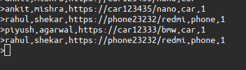
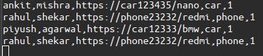

# custDataStream
It is a simple beginner level project.

Use Case: In Ecommerce application a person tries to buy product by visiting the product page, in some cases
persong visit the product page multiple times a day but do not purchase.

Solution: Real time tracking the number of visit for the particular product for every user and submit it to 
reporting team so businesses can develop custom offer for specific users.

The project pipeline contains kafka, spark streaming, cassandra.

Kafka is used to listen to click event website to receive the streaming data.

Here I am using kafka producer to demonstrate the project workflow, in real project kafka producer will be inbuilt inside the app.

Producer

Consumer

The streaming data is then processed and written in cassandra using spark streaming APIs.

The data in cassandra furthure can be used by reporting team and business to target customer with custom offers. 

Cassandra cust_data table

